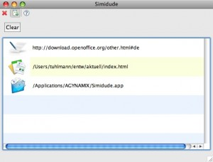
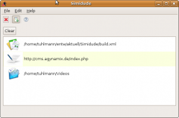

I had some slight problems with my Wordpress installation that prevented me from uploading files. Since I corrected the problems now I'd like to present the first screenshots of Simidude. To not offend any particular platform or their followersI will present the screenshots in alphabetic order :) :

Mac OS X:
---------

\[caption id="attachment\_68" align="alignnone" width="300" caption="Simidude on Mac OS X 10.5"\]\[/caption\]

MS Windows Vista:
-----------------

\[caption id="attachment\_69" align="alignnone" width="300" caption="Simidude on Vista"\]\[/caption\]

Ubuntu Linux 8.10:
------------------

\[caption id="attachment\_70" align="alignnone" width="300" caption="Simidude on Ubuntu"\]\[/caption\] Now Simidude still feels pretty rough around its virtual edges but it's already pretty usable. I hope to post a first beta version before the end of November. I restrain myself from adding new features. Instead I'm gonna make the available features more robust and the whole thing easier to use. In a Simidude network one of the installations acts as a server. This server will accept connections from other Simidude clients and will coordinate the traffic from one client to another. Apart from that the server is nothing special. I choose this setup to be able to connect clients which are in different subnets, for instance a virtual machine that runs through a NAT network connection. The NAT will give the VM their own address realm. Using peer-to-peer here would only work if you had a relay kind of server that would initiate the connection between two Simidude installations. So instead I choose to let one installation play the part of the server. The user has to tell Simidude through its preferences whether it should act as a server or as a client. When acting as a server Simidude can self detect it's current network address and use it to listen for incoming requests. When acting as a client however the user has to give it the server's address so the client can setup a connection. I want to make this part easier. I might use a network broadcast to find out if there is a server somewhere in the same subnet listening and automatically set the found network address. That should work in most cases. People who use NAT networks know how to set an IP address anyway :) So if you are interested in this kind of application please let me know what kind of features you'd expect.
