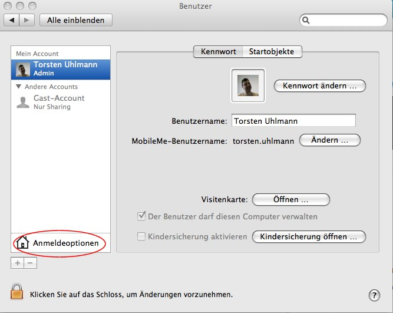
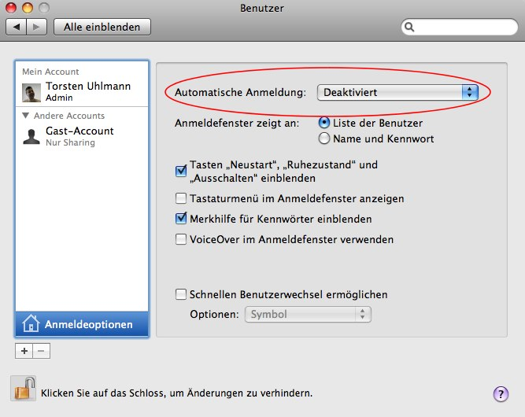
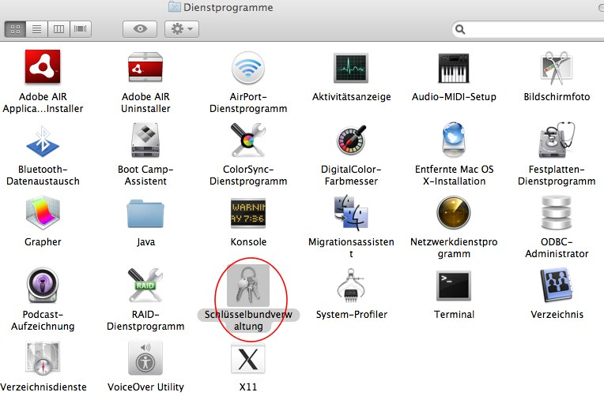
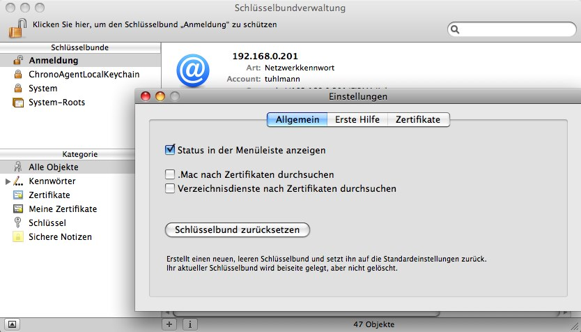
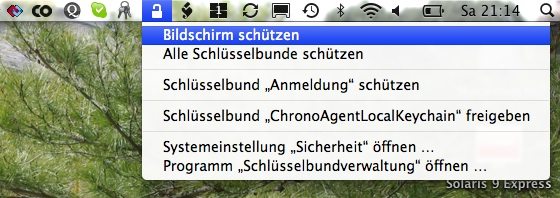

When using your Mac in a busy environment it might be important to shield it against unauthorized access. If you leave your desk to head for that donut of yours or to dispose of the many coffee you drank you may not want to leave your machine unattended. There are two simple settings that will prevend any unauthorized access to your Mac:

1- Require a password when your Mac starts up
---------------------------------------------

When the Mac starts it usually shows your desktop right away. This is convinient but also very insecure- especially if you leave your box unattended. Do the following to make OS X behave more appropriate:

-   Start your settings dialog and open "user settings"
-   Click on "Login Settings" (you may need to unlock that screen by clicking on the lock in the left corner of that screen"
-   Choose "Automatic Login deactivated"
-   Lock the screen and close.

2- Lock your screen when you're away
------------------------------------

I found two possible ways to lock the screen of my Mac. There first one is to enable "quickly change user". You can set this up on the same screen as "Automatic Login deactivated". You can set it up to display a small user icon in the menu bar. When you click on it you get the option to change to the login window which effectively asks for your password before it would let you see your desktop again. Unfortunately this one also separates UMTS connections and possibly other things. Another way is to go through your keychain manager:

-   Open the keychain manager
-   Choose settings and enable "Show status in menu bar"
-   This will show you a little lock symbol in the menu bar. Clicking it gives you the option to lock your screen. You need to enter your password to get back to your desktop. I like this option better- it looks more appealing and doesn't seem to separate any connections.

Do you know any other security tips? Let me and others know be commenting here! Have a great day!

–

My name is Torsten Uhlmann, I’m founder of [AGYNAMIX](http://www.agynamix.de/), a tiny (sooo tiiiny its just me) software company specializing in Java software consulting for larger corporations.

I also develop [Simidude](http://www.simidude.com/), a cross platform network clipboard and Drag&Drop tool which you might happen to find useful.
